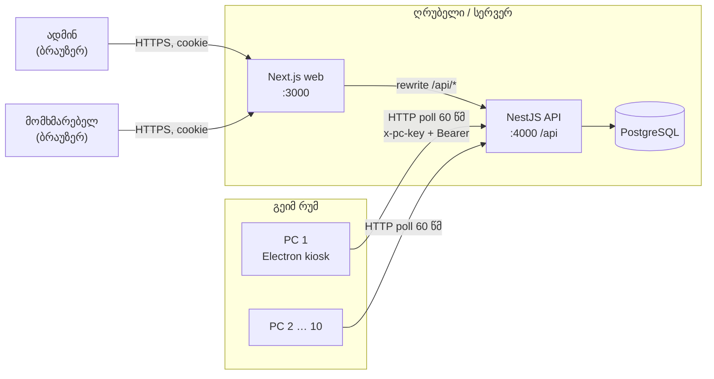

# არქიტექტურ



## კომპონენტებ

| კომპონენტ | პასუხისმგებლობ |
|---|---|
| **API** (`apps/api`) | ავტორიზაცი, CRUD, ბალანს, **ბილინგ**, ალერტებ, PC სტატუს, რეპორტებ, stale-session cron |
| **Web** (`apps/web`) | ადმინ-პანელ (დაშბორდ, users, PCs, reports, alerts) + მომხმარებლის პროფილ. API-ს იძახის იგივე origin-ზ (`/api` rewrite) → cookie `SameSite=Lax`, CORS არ სჭირდებ |
| **Desktop** (`apps/desktop`) | kiosk; ლოგინ, countdown, heartbeat 60 წმ, ალერტებ, shutdown |
| **Shared** (`packages/shared`) | ტიპებ, error-code თარგმანებ, დროს ფორმატირებ |

## მონაცემთა მოდელ

```mermaid
erDiagram
    admins ||--o{ balance_transactions : "adjusts"
    admins ||--o{ alerts : "acknowledges"
    users ||--o{ sessions : has
    users ||--o{ balance_transactions : has
    users ||--o{ alerts : about
    users ||--o{ password_reset_tokens : has
    pcs ||--o{ sessions : hosts
    pcs ||--o{ alerts : on
    sessions ||--o| balance_transactions : "SESSION_CHARGE"
    sessions ||--o{ alerts : raises

    users { int id PK; string name; string email UK; string phone UK; int balance_seconds; bool is_active; int token_version; timestamp deleted_at }
    pcs { int id PK; int number UK; string name; timestamp last_seen_at; enum pending_command }
    sessions { int id PK; int user_id FK; int pc_id FK; enum status; timestamp started_at; timestamp last_billed_at; timestamp last_heartbeat_at; int consumed_seconds; enum end_reason }
    balance_transactions { int id PK; int user_id FK; enum type; int amount_seconds; int balance_after_seconds; int session_id FK; int admin_id FK }
    alerts { int id PK; enum type; int user_id FK; int pc_id FK; timestamp acknowledged_at }
```

სქემ: `apps/api/prisma/schema.prisma`.

## ავტორიზაცი

| ვინ | როგორ |
|---|---|
| ადმინ | `ADMIN_EMAIL`/`ADMIN_PASSWORD` env → `admins` ცხრილ (upsert ყოველ start-ზ). JWT `{sub, role:'admin'}` httpOnly cookie-შ |
| მომხმარებელ | email **ან** ტელეფონ + პაროლ (bcrypt). JWT `{sub, role:'user', tv}`; `tv` = `token_version` — პაროლის შეცვლ/აღდგენ/დეაქტივაცი ძველ token-ებ აუქმებ |
| PC | `x-pc-key` (`PC_AGENT_KEY`, timing-safe) + login-ის შემდეგ session JWT `{sub, sid, pc, typ:'pc'}` (მიბმული PC ნომერზ) |

Rate limiting: `@nestjs/throttler` (login 20/წთ, forgot-password 5/წთ, ზოგად 600/წთ IP-ზ).

## Polling ინტერვალებ

| ვინ | რა | ინტერვალ |
|---|---|---|
| Desktop | `POST /desktop/heartbeat` | **60 წმ** (მოთხოვნ) |
| Web admin | `GET /alerts?status=open` | 30 წმ |
| Web admin | `GET /pcs` | 30 წმ |
| Web customer | `GET /me` | 30 წმ |
| API cron | stale sessions sweep | 30 წმ |

## უსაფრთხოებ

- პაროლებ — bcrypt (10 rounds). Reset token — 32 byte random, DB-ში მხოლოდ sha256, 1 სთ, ერთჯერად.
- `forgot-password` ყოველთვ `200` (email enumeration-ის წინააღმდეგ).
- Cookie: `httpOnly`, `SameSite=Lax`, production-შ `COOKIE_SECURE=true`.
- ValidationPipe `whitelist + forbidNonWhitelisted`.
- Production-შ `JWT_SECRET` ≥ 32 სიმბოლ (სხვაგვარ API არ ჩაირთვებ).
