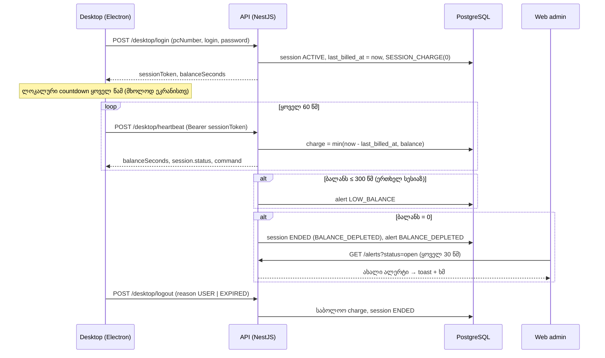

# ბილინგი — დროის ჩამოჭრის ლოგიკ

> ეს ფაილი არის სისტემის ყველზე კრიტიკული ლოგიკის „წყარ“. `apps/api/src/sessions/billing.service.ts`-ის ნებისმიერ ცვლილებ აქ უნდა აისახოს და `apps/api/test/app.e2e-spec.ts`-ის ტესტებ უნდა გადიოდნ.

## ერთეულებ

- ბალანს ინახებ **წამებშ**: `users.balance_seconds` (integer).
- ადმინი შეჰყავს **საათებ** (მაგ. `1.2` = 1 სთ 12 წთ = 4320 წმ). კონვერტაცია: `Math.round(hours * 3600)`.
- UI აჩვენებს `1 სთ 12 წთ` / `01:12:00`.

## ინვარიანტებ

1. `balance_seconds` **არასდროს** < 0 (ჩამოჭრა ყოველთვის `min(elapsed, balance)`).
2. ჩამოჭრ ითვლებ **სერვერზ** `sessions.last_billed_at` კურსორიდან. კლიენტის საათ არ ენდობ.
3. ყოველ ცვლილებ — DB ტრანზაქციაში row-lock-ებით, **ფიქსირებული რიგით**: `pcs → users (id ზრდადობით) → sessions` (deadlock-ის თავიდან აცილებ).
4. ყოველ სესია აქვს **ზუსტ ერთ** `SESSION_CHARGE` ტრანზაქცია; მისი `amount_seconds = -consumed_seconds` და ახლდებ ყოველ ჩამოჭრისას.
5. ერთ მომხმარებელ — მაქს. ერთ `ACTIVE` სესია; ერთ PC — მაქს. ერთ `ACTIVE` სესია.

## ნაკად



## ჩამოჭრის ფორმულ

```
elapsed        = floor((upTo - last_billed_at) / 1000)          // წამებ
charge         = min(elapsed, balance)                            // consumeAll → balance
balance       -= charge
consumed      += charge
last_billed_at = last_billed_at + elapsed * 1000                  // ms-ის ნაშთი არ იკარგებ
```

## ეტაპებ და კიდურა შემთხვევებ

| სცენარ | ქცევ | `end_reason` |
|---|---|---|
| Heartbeat, ბალანს > 0 | charge up to now | — |
| Heartbeat, ბალანს ≤ `LOW_BALANCE_THRESHOLD_SECONDS` (300) | `LOW_BALANCE` ალერტი (ერთხელ სესიაზ, `low_balance_alerted`) | — |
| Heartbeat, ბალანს → 0 | სესია ხურავს, `BALANCE_DEPLETED` ალერტ | `BALANCE_DEPLETED` |
| მომხმარებელ დააჭირა „გამოსვლ“ | charge up to now | `LOGOUT` (ან `BALANCE_DEPLETED` თუ ზუსტ 0 დარჩ) |
| კლიენტის countdown = 0 → `logout(EXPIRED)` | charge up to now; თუ დარჩა ≤ 60 წმ (საათების სხვაობ) — ჩამოიჭრებ **ყველ** | `BALANCE_DEPLETED` |
| PC აპის რესტარტ, იგივე user, იგივე PC | ძველი სესია **გრძელდ** (resume) | — |
| იგივე user სხვა PC-ზ (ძველი სესია ცოცხალ) | `409 ALREADY_LOGGED_IN_ELSEWHERE` | — |
| იგივე user სხვა PC-ზ (ძველი > timeout) | ძველი ხურავს, ახალი იწყებ | `TIMEOUT` |
| სხვა user ლოგინდებ PC-ზ, სადაც ძველი სესია ღიაა | ძველი ხურავს (charge up to `last_heartbeat + 60s`) | `REPLACED` |
| PC-დან heartbeat არ მოდის > `SESSION_TIMEOUT_SECONDS` (180) | cron (ყოველ 30 წმ) ხურავს; charge up to `min(now, last_heartbeat + 60s)` | `TIMEOUT` |
| ადმინი: PC → `LOGOUT` / `SHUTDOWN` | სესია ხურავს **მომენტალურ**; ბრძანებ მიდის PC-ზე მომდევნო heartbeat-ზ (ერთხელ) | `ADMIN_FORCED` |
| ადმინი დეაქტივირებს მომხმარებლ | აქტიური სესია ხურავს | `ADMIN_FORCED` |
| ადმინი სესიის დროს ბალანს ცვლდ | შემდეგ heartbeat ახლ ბალანსით ითვლ; 0 → `BALANCE_DEPLETED` | — |

## რატომ არა სოკეტ

მოთხოვნის მიხედვით კლიენტი API-ს იძახის **1 წუთში ერთხელ**. ეკრანზე წამ-წამ countdown ლოკალურ ითვლებ ბოლ სერვერული ბალანსიდან, ყოველ heartbeat ახლ „ჭეშმარიტ“ მნიშნელობ. ერთადერთი დამატებით გამოძახებ — `logout` (ღილაკ ან countdown = 0) — ეს მოვლენ, არა polling.

Consequences:
- ვებზ PC-ის ბალანს/სტატუს შეიძლება ჩამორჩეს ≤ 60 წმ.
- ალერტი ვებზ ჩნდებ ≤ 60 წმ (heartbeat) + ≤ 30 წმ (web poll) შემდეგ; `EXPIRED` logout-ის შემთხვევაში — ≤ 30 წმ.
- თუ PC კავშირს კარგავს, კლიენტი ლოკდ `offlineGraceSeconds` (180 წმ) შემდეგ, სერვერი — timeout-ზ.

## ისტორია (ledger)

`balance_transactions`:

| type | amount | ვინ |
|---|---|---|
| `TOPUP` | + | ადმინ (`adminId`) — მ.შ. „Initial balance“ შექმნისას |
| `DEDUCTION` | − | ადმინ |
| `SESSION_CHARGE` | − (live) | სესია (`sessionId`, `note` = PC-ის სახელ) |

`balance_after_seconds` = ბალანსი ამ ჩანაწერის **ბოლ განახლების** მომენტშ.
